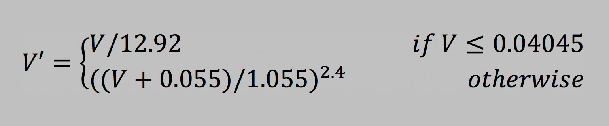
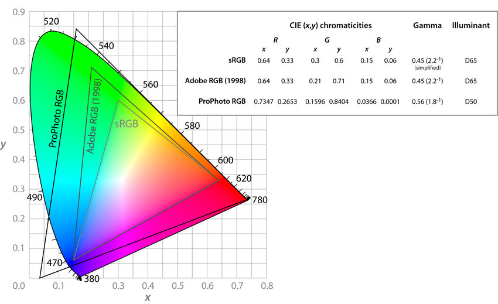
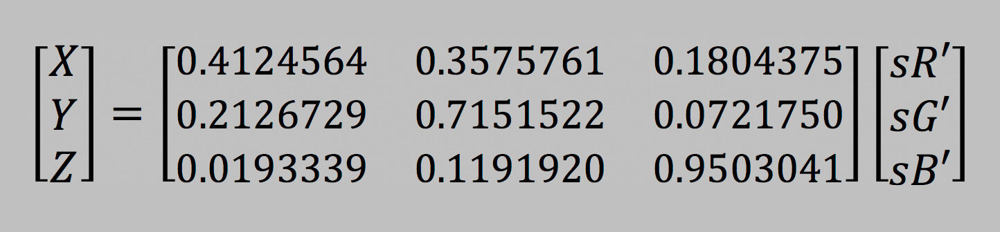
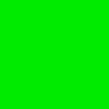
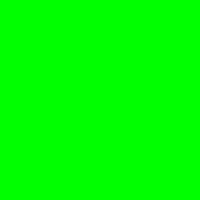
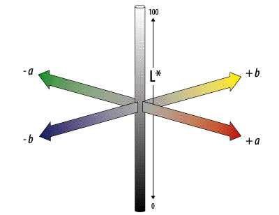
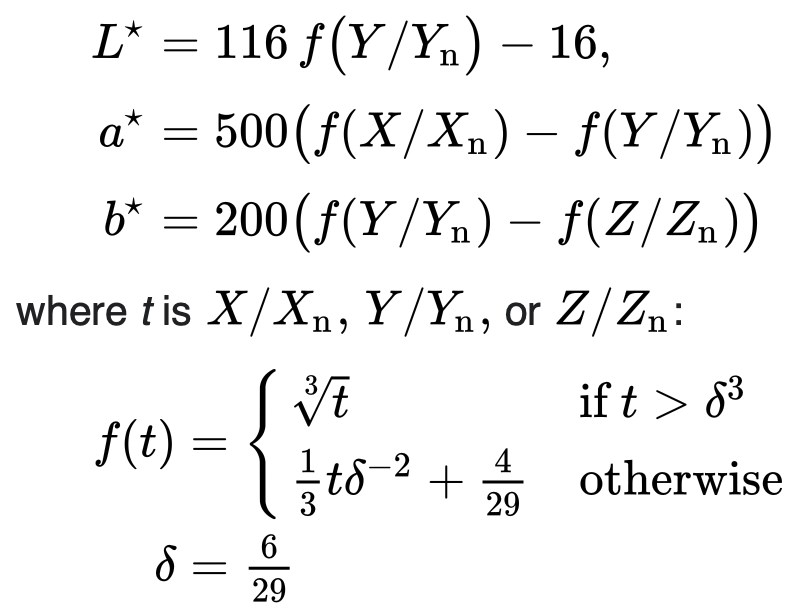
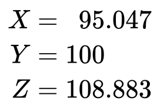

# DELTA E 2000
**`ΔE2000`** is the mathmatical formula (transposed to algorythm) used in this project to establish the distance between two colors in a metric that mimics the human perception.

It performs way better than it's precessors **`ΔE76`** and **`ΔE94`**, and is currently the best option for the task, used in various well estabilished color treatment libraries.

## Color space conversion

The process of metrifying the distance between two colors as we see is not a trivial task, but follows a guide of steps that won't fail if correctly aplied.

> [!WARNING]
> In this explanation I won't bother to explain the meaning of every "magic constant" that apears trought the implementation (since most of them not even I comprehend), but all of them can be found in the various articles mentioned in this documentation.

First of all, we can't jump to the formula right away, since the usual **RGB** pixels extracted directly from images are not the ones we are going to use.

We have to apply the following conversions before even thinking of the **`ΔE2000`** formula:
- RGB ---> Linearized RGB
- Linearized RGB ---> CIE_XYZ
- CIE_XYZ ---> CIE_LAB

And only then we can use the "CIE_LAB pixels" in our calculations.

### Linearized RGB

First of all, what is the problem with conventional RGB in terms of calculation?

It may seem counterintuitive, but RGB values have a **non linear** light perception. For instance, take the two following colors:

color 1

color 2

The first one is pure red (255, 0, 0) and the seccond is "half pure red" (128, 0, 0), but as you can see, it apears to have way less than half the light energy, and that's because it has indeed.

The actual half red would be closer to (187, 0, 0):

color 3

And thats exactly were the problem lies, because CIE_XYZ rely on linear perception of light.

With that in mind, we can first normalize the RGB values (divide by 255) so that their range stays between 0 and 1. Then, we can apply the linearizing function, defined as:

Reference: [How-to-convert-between-srgb-and-ciexyz](https://www.image-engineering.de/library/technotes/958-how-to-convert-between-srgb-and-ciexyz).

### CIE_XYZ
With linear RGB in hands, now we raise the question: How can we make the colors used in our calculations agnostic to device?

The same image, if displayed in various devices, will have, inevitably, color missmatches due to hardware and software particularities. There are also many different RGB spectrums, each one with specific primary reference colors, like sRGB, Adobe RGB and ProPhoto RGB.

To adress this issue, the **_Commission Internationale de l’Eclairage_ (CIE)** established the CIE_XYZ color space, with the premisse of it being universaly independent from device specifications, focusing exclusively on phisical perception. 

In resume, the CIE_XYZ is like if every application in the world could see color in the same perspective.

The conversion process from linear RGB to CIE_XYZ is as simple as a matrix product:

Reference: [How-to-convert-between-srgb-and-ciexyz](https://www.image-engineering.de/library/technotes/958-how-to-convert-between-srgb-and-ciexyz).
> [!WARNING]
> The values used in the matrix are only valid under the reference of D65 as the "Pure White", wich represents typical light conditions and is what we are gonna use for this project.

### CIE_LAB

Now that we've got **CIE_XYZ** values, our pixels are only one conversion away from being able to integrate the **`ΔE2000`** algorythm.

But what's wrong with **CIE_XYZ** in the first place? Why do we need **CIE_LAB** to replace it?

It's actualy very simple. The **CIE_XYZ** follows a linear light perception, while the human eye perception is closer to a logarithmic scale.

Take the following squares as example:

The first two are obviously different, but the following two seem practicaly identical.

But what if I tell you the RGB difference between the first two is exactly the same as the distance between the seccond two? And more shockingly, in the **CIE_XYZ** colorspace the difference between the seccond two is actually bigger!

The values in each colorspace are:

|RGB|CIE XYZ|CIE LAB|
|-----|---------|---------|
|(0, 20, 0)|(0.00250139, 0.00500278, 0.000833797)|(4.52, -9.23, 6.6)|
|(0, 40, 0)|(0.00758741, 0.0151748, 0.00252914)|(12.72, -23.74, 18.31)|
|(0, 235, 0)|(0.297063, 0.594127, 0.0990211)|(81.52, -81.02, 78.19)|
|(0, 255, 0)|(0.357576, 0.715152, 0.119192)|(87.73, -86.18, 83.18)|

> [!NOTE]
> The algorythm used for the conversion RGB->CIE_XYZ can be found in the code, but the one used in the conversion RGB->CIE_LAB was: [rgb-to-lab-calculator](https://colordesigner.io/convert/rgbtolab).

But the distances between the pairs of lines in each colorspace are: 

|ΔRGB|ΔXYZ|ΔLAB|
|-----|---------|---------|
|20|0.0114983|20.3705|
|20|0.136805|9.4962|

> [!NOTE]
> Again, the `ΔXYZ` was calculated with the very own code of the project, but the `ΔLAB` was calculated with: [cie-76-calculator](https://colormine.org/delta-e-calculator).

> [!IMPORTANT]
> All the `Δ` were calculated as simple euclidian distances, but with the `ΔE2000` formula the **CIE_LAB** can be used to achieve way more precise results.

That raises the question: why does the `CIE_XYZ` scale seems weird? Actualy, it is very precise for it's own purpouse. Differences in the `CIE_XYZ` colorspace represent phisical luminance variation.

For instance, take the linearized versions of the **RGB** values:

|Linearized RGB|
|--------------|
|(0, 0.006995, 0)|
|(0, 0.021219, 0)|
|(0, 0.83077, 0)|
|(0, 1, 0)|

If we consider 0 in RGB as 0% luminous energy in that chanel, and 1 as 100%, we would have the following values for the luminous percentage in the green chanel in each square:

|Aproximate Luminous %|
|--------------|
|0.7%|
|2%|
|83%|
|100%|

Which means the phisical difference in luminosity between the first two squares represents only 1.3% while the difference between the seccond two is 17%.

And why do we not see that difference? We can exagerate even more our example to explain that. 

Imagine you are in a completely dark room.

Now turn on a green light at 5% brightness. It will feel like a big change, since the room was totally black, and suddenly there is visible light. Even a small amount makes a noticeable difference.

Now compare that to a green light going from 80% brightness to 100%. Both are already very bright. The extra 20% is there physically, but your eyes won’t notice the change as easily.

Our vision works this way:
- In dark conditions, small increases in light feel large.
- In bright conditions, even larger increases feel small.

With that in mind, now it's clear why the `ΔXYZ` is bigger for the seccond pair of squares. But why do the `ΔLAB` does a way better job at mimicking the human eye perception?

The **CIE_LAB** color space threats colors as oposed axis:

The `L` value represents light, but not in a phisical way, but a perceptual one, and the `A` and `B` axis represent, respectively, the green <=> red oposition and the yellow <=> blue oposition. Coincidentally (actually not) our visual system works in the same way.

The `f()` function, or as I like to call it, the `non_linear_CIE_LAB_lightness_correction` is the protagonist in this matter. It corrects the `Y` axis of the `CIE_XYZ` color space to match the human perception of light. Essentialy, it spreads the dark tones and compresses the light ones, solving the distance issue that we saw with the `ΔXYZ`.

Now that the intuition is solved, lets jump to the conversion. The formula we are gonna use is:

Refference: [CIE_XYZ_to_CIE_LAB](https://en.wikipedia.org/wiki/CIELAB_color_space)

With the respective values of Xn, Yn and Zn:

Refference: [Standard_Illuminant_D65](https://en.wikipedia.org/wiki/Standard_illuminant#D65_values)

> [!WARNING]
> Since we are working with a maximum luminosity value of 1 (Yn <= 1), all the standard illuminant values have to be divided by 100.

